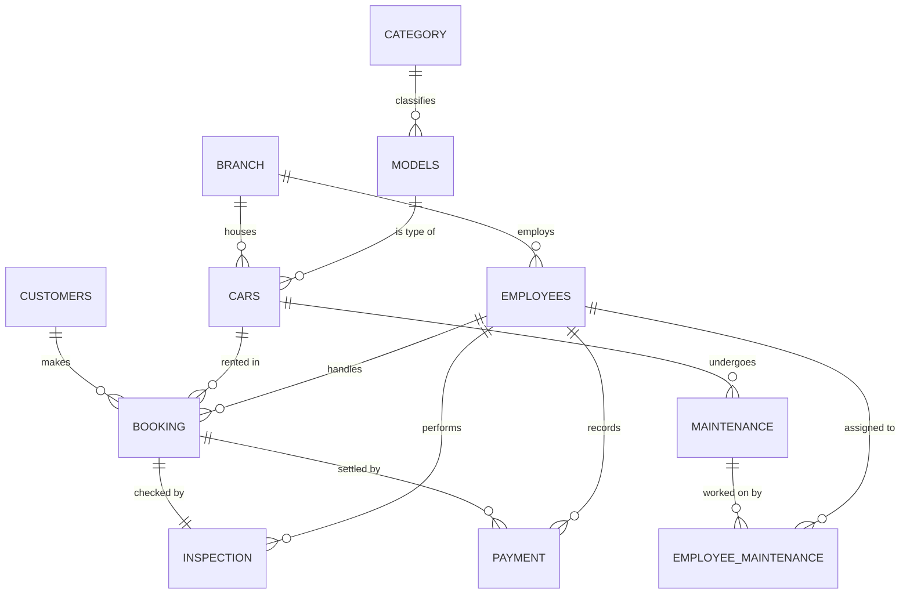

# Car Rental Management System

A web-based management system for a multi-branch car rental company, built around a
relational MySQL/MariaDB database. The project covers the internal **staff (admin)
side** of the business: renting cars out, handling returns and inspections, sending
damaged cars to maintenance, and recording payments.

The main focus of the project is the **database design** — the structure, the
relationships between entities, the integrity constraints, and the business rules
enforced directly in the database through triggers. The PHP pages act as a thin
interface that exercises that database.

---

## Scope and assumptions

- **Staff side only.** There is no customer-facing website. Every page is operated by
  a company employee (receptionist or mechanic), not by the renter.
- **Authentication is assumed, not implemented.** Workers are treated as already logged
  in and are identified by their unique `Emp_id`. This was a deliberate scope decision so
  the work could concentrate on the data model rather than on a login/session layer.
- **Single company, multiple branches.** Cars, employees, and rentals are all scoped to
  a branch, so the same model of car can exist in several branches independently.

---

## Technology stack

| Layer | Technology |
|-------|-----------|
| Database | MariaDB 10.4 (MySQL-compatible) |
| Backend | PHP 8.2 (procedural `mysqli`, with one prepared-statement example) |
| Server | Apache, via XAMPP |
| Admin tooling | phpMyAdmin (used to design and export the schema) |
| Frontend | Plain HTML forms with inline PHP; one shared `style.css` |

---

## Database design

The database is named `Car Rental` and contains **11 tables**. Below is the overall
entity-relationship map, followed by the purpose of each table.

### Entity-relationship diagram



### Tables and their purpose

**`Branch`** — the physical rental locations (e.g. Dire Dawa, Addis Ababa, Messina).
Cars and employees both belong to a branch, which is what makes the company multi-site.

**`Category`** — broad vehicle classes (Economy, Compact, Sedan, SUV, Luxury) used to let
staff filter the cars they offer to a customer.

**`Models`** — a car *model* and the information shared by every physical unit of it:
brand, name, base `Price_per_day`, fuel type, and the category it belongs to. Separating
the model from the individual car avoids repeating this information on every car (this is
the core normalisation decision in the schema).

**`Cars`** — a *physical* vehicle: its plate number, colour, the branch it sits in, the
model it is an instance of, whether it is currently available, and a per-car
`Price_adjs`. `Price_adjs` is a condition-based adjustment applied on top of the model's
base price: the rental price is `Price_per_day * (1 - Price_adjs)`, so a car in poorer
condition can be discounted relative to a pristine one of the same model. Mechanics can
update this value after maintenance.

**`Customers`** — people who rent cars, with unique driving licence and phone number.

**`Employees`** — company staff, each tied to a branch and given a `Role` of `Manager`,
`Receptionist`, or `Mechanic`. The role drives which part of the system a person uses.

**`Booking`** — the central transaction table: which customer rented which car, handled
by which employee, with a start date and an end date that stays `NULL` while the rental
is active.

**`Inspection`** — a record created when a car is returned, holding the inspecting
mechanic, any damage description, a possible `Fine`, and a done/not-done flag. It is
linked one-to-one to a booking (a booking has a single inspection).

**`Maintenance`** — opened only when an inspection finds damage. It tracks the repair
period (start/end date) and a description; while the end date is `NULL` the car is still
in the shop.

**`Employee_Maintenance`** — a junction table resolving the many-to-many between
mechanics and maintenance jobs, because a single repair can involve several mechanics.

**`Payment`** — every payment made to the company, tied to a booking and the employee
who took it. The `Type` column (`Booking` or `Fine`) distinguishes the rental charge from
a separate damage fine, so one booking can produce more than one payment row.

### Integrity and business rules

The schema relies on the database itself to keep data consistent, rather than trusting
the application to always do the right thing:

- **Foreign keys** connect every relationship shown in the diagram, so you cannot, for
  example, create a booking for a car or customer that does not exist. The
  `Payment → Booking` link uses `ON DELETE CASCADE`, so removing a booking cleans up its
  payments automatically.
- **Unique constraints** protect real-world identifiers: car plate numbers, customer
  licence numbers and phone numbers, payment invoices, branch names, and one inspection
  per booking.
- **Two triggers** enforce rules that foreign keys cannot:
  - *Prevent double booking* — a `BEFORE INSERT` trigger on `Booking` blocks a customer
    from holding the same car twice at once (an existing booking with a `NULL` end date).
  - *Prevent overlapping maintenance* — a `BEFORE INSERT` trigger on `Maintenance` stops a
    car from having two open maintenance records at the same time.

---

## Application structure

```
Admin/
├── db.php                  # database connection (shared by every page)
├── admin_home.php          # receptionist entry point (rent / return / history)
├── customer_history.php    # look up a customer's rentals by phone number
├── style.css
│
├── Car_rent/               # the rent-out flow
│   ├── rent_car.php             # choose categories
│   ├── rent_select_car.php      # list available cars in the employee's branch
│   ├── rent_customer.php        # search the renting customer
│   ├── rent_customer_process.php# branch: existing vs new customer
│   ├── rent_create_customer.php # register a new customer
│   └── Car_rented.php           # create the booking, mark car unavailable
│
├── Car_return/             # the return flow
│   ├── return_car.php           # start a return
│   ├── find_booking.php         # find the active rental by phone
│   ├── wait_for_inspection.php  # open/await the inspection
│   ├── close_booking.php        # close booking, route to maintenance or payment
│   └── return_done.php
│
├── Mechanic/               # the mechanic side
│   ├── mechanic_home.php
│   ├── mechanic_inspection.php  # record damage and fine for a return
│   ├── save_inspection.php
│   ├── mechanic_maintenance_list.php
│   ├── maintenance_work.php      # assign mechanics, update condition
│   └── finish_maintenance.php
│
└── Payment/                # taking payment
    ├── rent_payment.php / rent_finalize.php   # the rental charge
    └── fine_payment.php                       # a separate damage fine
```

---

## Core workflows

**Renting a car.** A receptionist starts at `admin_home.php`, picks the categories the
customer is interested in, and is shown the available cars *in their own branch* with the
condition-adjusted daily price. After selecting a car, the system looks the customer up by
phone — registering a new one if needed — then creates a `Booking` and flips the car to
unavailable.

**Returning a car.** The receptionist finds the customer's active rental by phone. The car
goes through an inspection: a mechanic records any damage and a fine. If there is no
damage the car is simply made available again; if there is, a `Maintenance` job is opened
instead. Either way the booking is closed (its end date is set) and the customer is sent
to pay.

**Maintenance.** Mechanics see the open jobs for their branch, record which colleagues
worked on the repair (via `Employee_Maintenance`), optionally update the car's condition
adjustment, and close the job — which returns the car to the available pool.

**Payment.** The rental charge is recorded as a `Booking`-type payment. If the inspection
raised a fine, a second `Fine`-type payment is taken for the same booking.

**Customer history.** Any customer's full rental history can be looked up by phone number,
joining bookings, cars, and models to show what they rented and when.

---

## Setup and running

1. Install and start **XAMPP** (Apache + MySQL/MariaDB).
2. Place the project folder inside XAMPP's `htdocs` directory.
3. In **phpMyAdmin**, create a database named `Car Rental` (note the space), then import
   `Car_Rental-3.sql` into it. This builds every table, the constraints, the triggers, and
   loads sample data.
4. Confirm the credentials in `Admin/db.php` match your setup (default: host `localhost`,
   user `root`, empty password, database `Car Rental`).
5. Open the app in a browser:
   - Receptionist: `http://localhost/<project-folder>/Admin/admin_home.php`
   - Mechanic: `http://localhost/<project-folder>/Admin/Mechanic/mechanic_home.php`

Because authentication is assumed, flows that need an operator simply take an `Emp_id`
(e.g. the rent flow asks for the handling employee's ID).

---

## Design notes and future work

The project intentionally put its effort into the data model, so a few application-layer
points are left as known improvements:

- **Prepared statements throughout.** Most pages build SQL by inserting input directly
  into the query string, which is open to SQL injection. `customer_history.php` already
  demonstrates the correct approach using `mysqli` prepared statements with bound
  parameters; the same pattern should be applied to the remaining pages.
- **Money as a string.** `Payment.Amount` is stored as `VARCHAR`; a `DECIMAL` type would
  be more appropriate for monetary values and arithmetic.
- **Naming consistency.** Several primary keys share the name `C_id` (customers, cars,
  categories) and `B_id` is used for both branches and bookings. The code works because
  every query qualifies columns by table, but distinct names (e.g. `Cu_id`, `Car_id`)
  would make the schema easier to read. Table-name casing is also mixed; standardising it
  matters on case-sensitive (Linux) MySQL servers.
